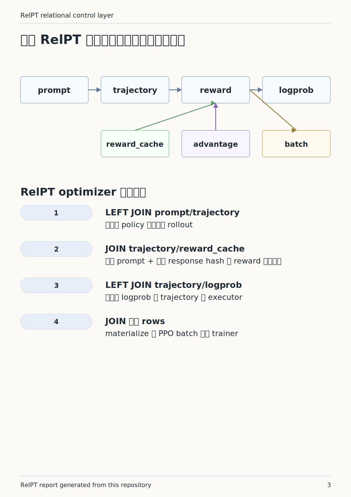
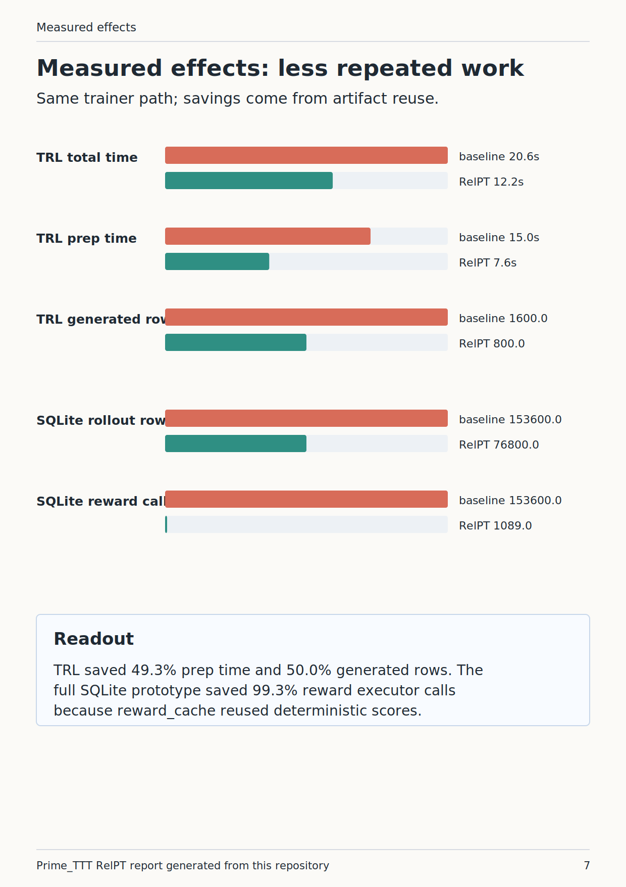
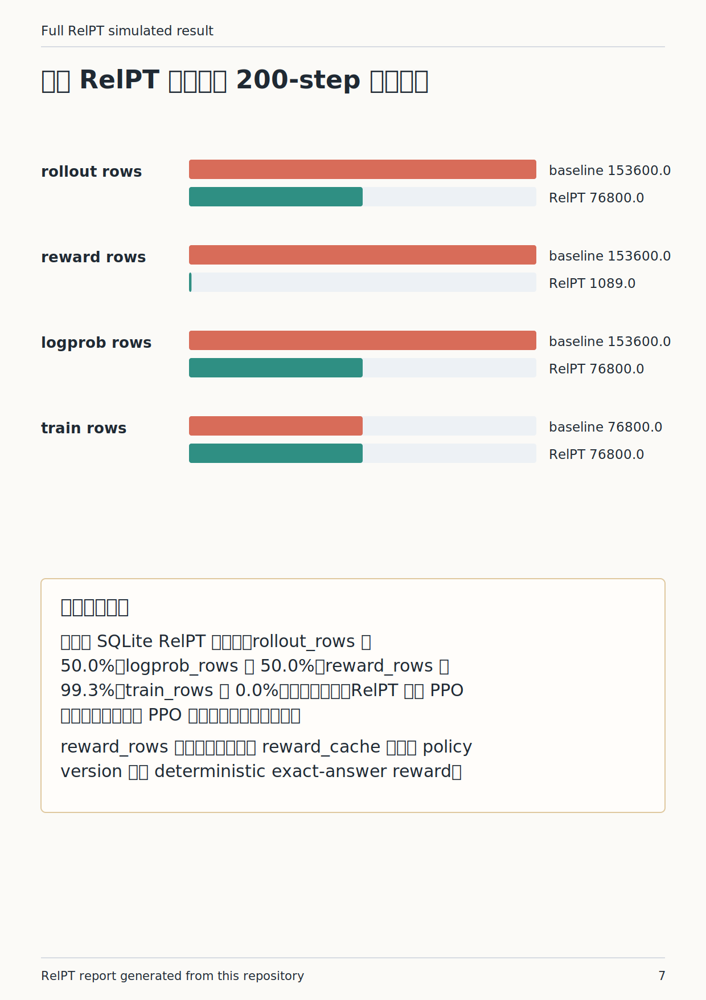

# RelPT 从零解释报告

这份报告解释本仓库里的 RelPT：它是什么、用哪些 table 和 SQL join、optimizer 做什么、为什么这样做，以及最新 PPO 对照结果怎么读。

## 一句话

RelPT 不是新的 PPO loss。它是 post-training 前处理阶段的关系型控制层：把 prompt、trajectory、reward、logprob、advantage、batch 等中间产物表化，然后只补缺失 rows，避免重复调用 rollout/reward/logprob executor。

## 图 1：RelPT 控制层

## 最新真实 TRL PPO 对照

- model: `sshleifer/tiny-gpt2`
- dataset: `pyarrow_arrow_cache`
- framework: `trl_ppo_0.11.4`
- steps: `200`
- batch size: `4`
- output: `runs/metrics/trl_ppo_relpt_17266929.json`

| metric | baseline | relpt | saved |
| --- | ---: | ---: | ---: |
| total_ms | 20576.0 | 12201.1 | 40.7% |
| prep_ms | 14955.4 | 7580.0 | 49.3% |
| generate_ms | 14887.2 | 7516.4 | 49.5% |
| reward_ms | 68.3 | 40.5 | 40.6% |
| generated_rows | 1600 | 800 | 50.0% |
| reward_rows | 1600 | 800 | 50.0% |

## 完整 SQLite RelPT 原型结果

## 怎么读结果

这次结果说明 RelPT 可以减少 PPO batch preparation 的重复工作。它没有说明 tiny-gpt2 在 GSM8K 上学会了数学，因为 final_eval_reward_delta 和 mean_train_reward_delta 都是 0.0。这个实验的重点是系统效率：同一个 PPOTrainer、同一个模型、同一个数据集，RelPT 减少了 generate/reward rows 和 preparation time。

PDF 版本见 `docs/relpt_report.pdf`。
